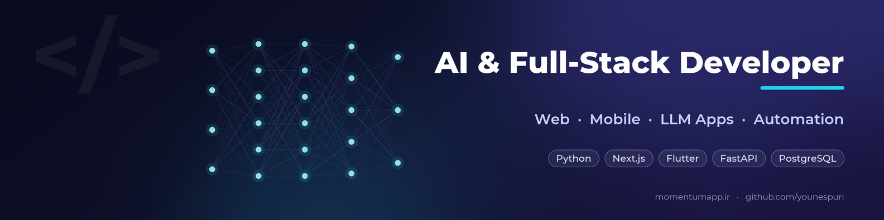
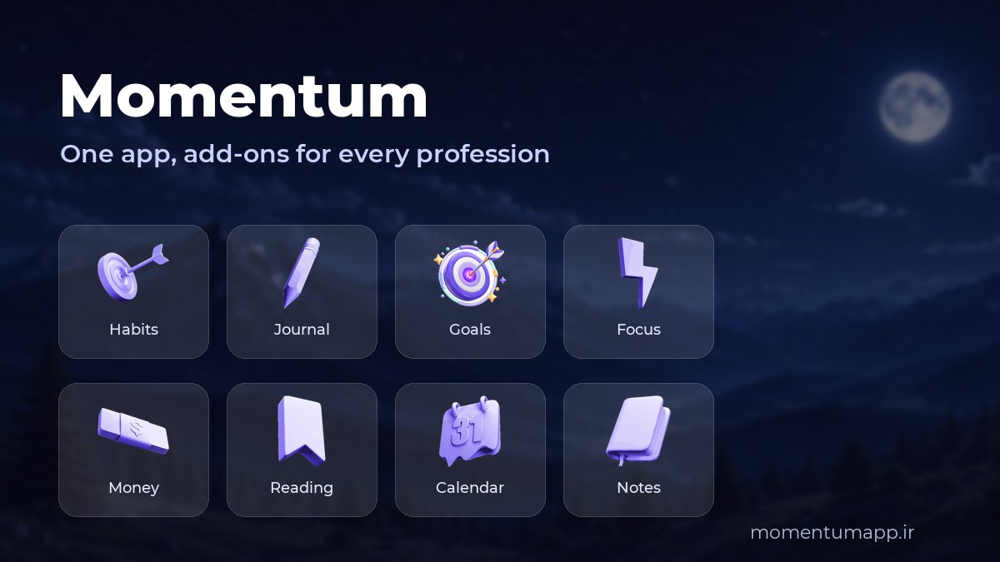
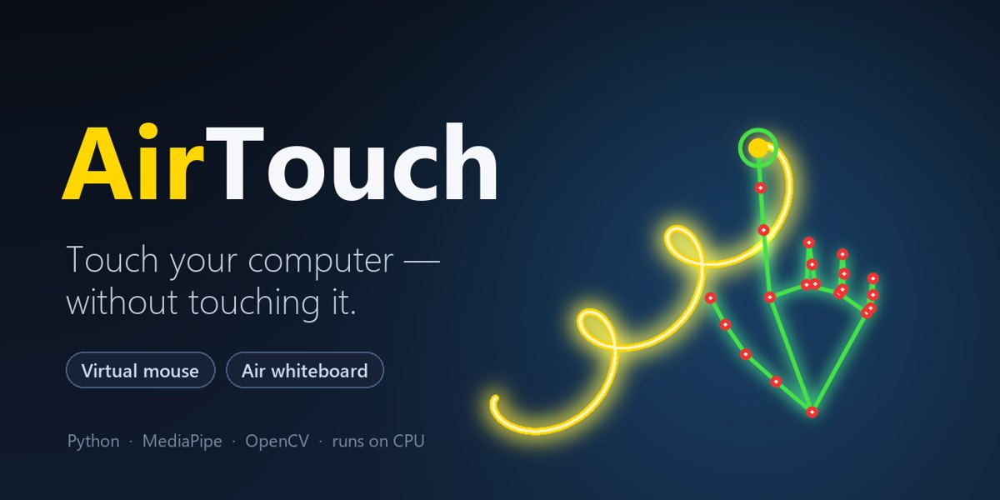
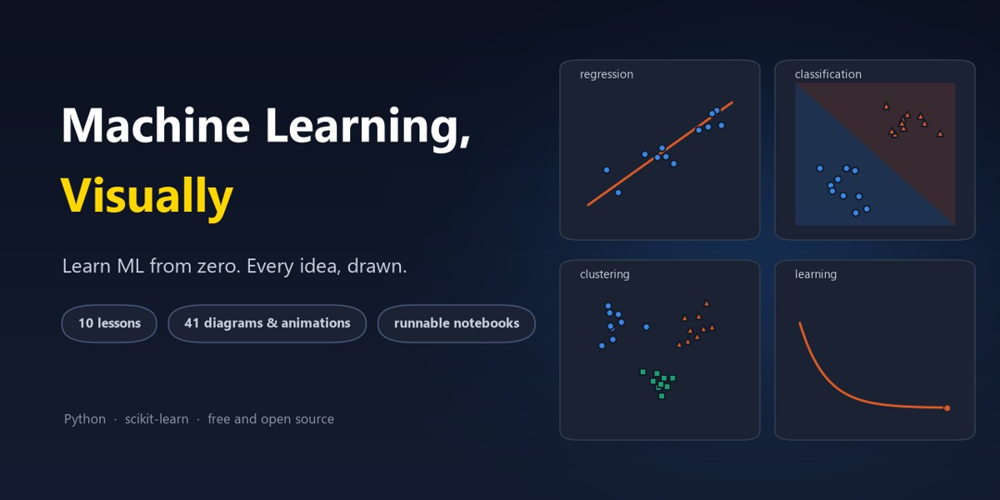

  

  
  
  
  
  
  
  
  
  

I build web, mobile and AI-powered products end to end, from the first idea to a live app. I've been shipping websites and apps since 2020, and today I focus on bringing AI into real products.

### What I work on

- **Product platforms:** apps built around a small core and installable add-ons, so one product can serve very different users.
- **AI in real products:** LLM integrations, retrieval over your own data (RAG), agents and workflow automation.
- **Computer vision:** real-time hand tracking that turns a webcam into a touch-free mouse and air whiteboard.
- **Teaching ML visually:** beginner-friendly lessons where every idea gets a diagram and runnable code.
- **Currently learning:** deep learning, after finishing a machine learning course.

### Featured work

<table>
  <tr>
    <td colspan="2" valign="top">
      
      
<b><a href="https://momentumapp.ir">Momentum</a></b> · <a href="https://momentumapp.ir">live</a> · in active development 
      A productivity platform where each profession gets its own add-ons on one shared base: habits, goals, a trading journal, study tools and more. On the web and Android. 
      React · Vite · Capacitor · Vitest · plugin architecture

    </td>
  </tr>
  <tr>
    <td width="50%" valign="top">
      
      
<b><a href="https://github.com/younespuri/AirTouch">AirTouch</a></b> 
      Control your computer without touching it: move the mouse and write in the air with just your hand and a webcam. 
      Python · MediaPipe · OpenCV · pytest

    </td>
    <td width="50%" valign="top">
      
      
<b><a href="https://github.com/younespuri/visual-machine-learning-for-beginners">Visual Machine Learning for Beginners</a></b> · with <a href="https://github.com/todos125m">@todos125m</a> 
      A free, diagram-first ML course: 10 lessons from "what is ML" to a final project, each with a runnable notebook. 
      Python · scikit-learn · pandas · Matplotlib · Jupyter

    </td>
  </tr>
</table>

### Toolbox

- **AI & data:** Python · FastAPI · scikit-learn · MediaPipe · OpenCV · NumPy · LLM APIs · RAG
- **Web:** React · Next.js · Vite · Node.js · Laravel · PHP · Tailwind
- **Mobile:** Flutter · Capacitor
- **Data stores:** PostgreSQL · MySQL · MongoDB

### Let's talk

[LinkedIn](https://www.linkedin.com/in/younespuri) · [Momentum](https://momentumapp.ir) · open to freelance projects and remote roles

Most of my product work lives in private repositories.
